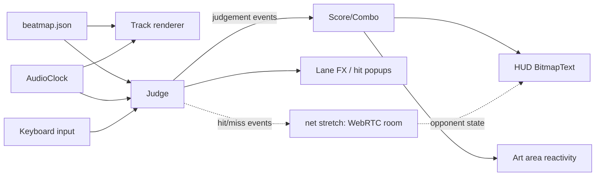

# Rhythm Game — Implementation Plan

A browser rhythm game (Magic Tiles 3 / DDR style) built with **PixiJS v8 + TypeScript + Vite**. Four horizontal lanes scroll notes toward a hit line; the player hits **D F J K** in time with the music. The track occupies the bottom of the screen; the top is reserved for reactive art. Stretch goal: 2-player online versus over **WebRTC** (STUN + serverless signaling — no dedicated server).

---

## 1. The one decision that makes or breaks a rhythm game: timing

**The audio clock is the only clock.** Frame timers (`requestAnimationFrame`, `Ticker.deltaMS`, `Date.now()`) drift against audio playback — accumulate them and notes desync from the music within a minute.

- Master time = `AudioContext.currentTime` (hardware audio clock, sub-ms precision).
- Play the song via `AudioBufferSourceNode.start(startAt)` scheduled ~100 ms in the future; store `startAt`. Song time is always `ctx.currentTime - startAt`.
- **Note positions are a pure function of song time** — computed fresh every frame, never incremented:

```ts
// gameplay render loop — app.ticker.add(() => { ... })
const t = clock.songTime();                    // seconds into the song
for (const note of activeNotes) {
  // notes close in on the hit line from the left; SCROLL_SPEED in px/sec
  note.sprite.x = HIT_X - (note.time - t) * SCROLL_SPEED;
}
```

- Judge key presses against song time captured **in the keydown handler** (not in the next frame).
- Ship a **calibration screen** (tap to a metronome → average offset → `localStorage`). Browser/device audio latency varies by tens of ms, which is a full judgement tier.

Everything else in this plan is ordinary game code; this part is the genre's hard requirement.

## 2. Tech stack

| Choice | What | Why |
|---|---|---|
| Renderer | **PixiJS v8** (WebGL/WebGPU) | Fast 2D, batching, we have team skills installed for it |
| Scaffold | `npm create pixi.js@latest game -- --template bundler-vite` | Official Vite + TS template, hot reload |
| Audio | **Web Audio API** (raw) | The precise clock IS the feature; libraries add abstraction we don't need |
| Language | TypeScript | Beatmap/protocol types catch jam-night mistakes |
| Multiplayer (stretch) | WebRTC DataChannel + public STUN + serverless signaling | No dedicated server to build or host |

Gotcha from the skills: on Vite ≤ 6.0.6 top-level `await` breaks production builds — wrap boot in an async IIFE:

```ts
(async () => {
  const app = new Application();
  await app.init({ resizeTo: window, background: "#0e0a1a", antialias: true });
  document.getElementById("app")!.appendChild(app.canvas);
  // scenes take over from here
})();
```

## 3. Screen layout & controls

```
┌──────────────────────────────────────────────┐
│                 ART AREA (~60%)              │   parallax bg, character whose
│      dance intensity scales with combo       │   animation reacts to combo/misses
│                                              │
├──────────────────────────────────────────────┤
│ HUD: score ······· combo ······· judgement   │
├───────────────────────────────────────────┬──┤
│  notes scroll right →          ● ······ ● │►D│
│                 ●            ●            │►F│  TRACK (~40%)
│       ●        ●                   ●      │►J│  4 lanes, hit line on the RIGHT
│            ●                  ●           │►K│  receptors light up on press
└───────────────────────────────────────────┴──┘
```

- **Keys D F J K** → lanes top-to-bottom (two per hand, no OS shortcut collisions). Keymap in one const so it's trivially rebindable.
- Notes spawn off-screen left, scroll right, are judged at the hit line on the right edge, and despawn (to the pool) after the miss window. Scroll direction lives in one sign constant, so flipping it later is a one-line change.
- **Scaling:** design against a 1280×720 virtual canvas; on `resize`, uniformly scale the root container (`scale = min(w/1280, h/720)`) and center it. Letterboxing beats fluid layout for jam scope. `resizeTo: window` keeps the canvas itself full-size.

## 4. Beatmap format

One folder per song under `public/songs/<id>/` with `song.ogg`, `chart.json`, `cover.png`.

```jsonc
{
  "title": "Neon Sprint",
  "artist": "…",
  "audio": "song.ogg",
  "bpm": 128,            // authoring metadata; gameplay uses absolute times
  "offset": 0.35,        // seconds from audio start to beat 0
  "notes": [
    { "t": 1.875, "lane": 0 },     // t = seconds; lane = 0..3
    { "t": 2.109, "lane": 2 }
    // stretch: { "t": 5.0, "lane": 1, "hold": 1.5 }
  ]
}
```

**Charting tool (cheap, huge payoff):** a dev-only "record mode" — play the song, tap D F J K along with it, dump captured `{t, lane}` to JSON in the console, hand-tune. An hour to build; makes everyone on the team a chart author. Quantize taps to the nearest 1/4 or 1/2 beat using `bpm`/`offset` so charts come out clean.

## 5. Judgement & scoring

On keydown: find the nearest unhit note in that lane within the widest window; judge by `|Δ|` (after subtracting the calibration offset). A sweep in the update loop marks notes past `t + 135 ms` as **Miss**.

| Judgement | Window | Points | Combo |
|---|---|---|---|
| Perfect | ±45 ms | 100 | +1 |
| Great | ±90 ms | 60 | +1 |
| Good | ±135 ms | 30 | +1 |
| Miss | beyond / never hit | 0 | reset |

- Pressing a key with no note in range does nothing (jam-friendly; no "ghost tap" penalty).
- Ignore `event.repeat` keydowns.
- Results grade by accuracy: S ≥ 95 %, A ≥ 90 %, B ≥ 80 %, C ≥ 65 %, else D. Track max combo.

## 6. Architecture



Gameplay systems communicate through a tiny typed event emitter (`judgement`, `combo`, `songEnd`, …) so HUD, art, and (later) networking subscribe without coupling — multiplayer becomes "forward these events to a peer."

### Module layout

```
src/
  main.ts              boot: async IIFE, app.init, scene manager
  core/
    clock.ts           AudioClock: context, load/decode, start(when), songTime()
    input.ts           key→lane map, keydown capture w/ timestamps, rebind-ready
    events.ts          tiny typed event bus
    beatmap.ts         types, loader, validation, beat↔seconds helpers
  game/
    scenes.ts          Scene interface + manager (Title → Gameplay → Results)
    gameplay.ts        wires clock+input+track+judge+hud+art for one song
    track.ts           lanes, receptors, note sprite pool, scroll rendering
    judge.ts           windows, nearest-note resolution, miss sweep
    score.ts           score/combo/accuracy state machine
  ui/hud.ts            BitmapText score/combo, judgement popup animations
  art/stage.ts         top area: parallax layers, combo-reactive character
  net/                 (stretch) room.ts, protocol.ts
  tools/recorder.ts    dev-only chart record mode
public/songs/<id>/     song.ogg + chart.json + cover.png
```

### PixiJS specifics (from the installed `/pixijs-*` skills)

- **Pool note sprites** — recycle with `visible` toggling instead of create/destroy per note (`pixijs-performance`).
- **HUD text is `BitmapText`** — score/combo change constantly; canvas `Text` re-uploads to GPU on every change, BitmapText just repositions glyph quads.
- **Ticker**: v8 callbacks receive the `Ticker` instance (`(ticker) => ticker.deltaMS`), not a delta number. We only use the ticker to drive rendering/tweens — never for song time.
- **Batching**: keep lane backgrounds (Graphics) and note sprites (Sprites) grouped by type in the child order; put all notes in one container.
- Keep each note skin in one spritesheet/atlas so the whole track renders in ~1 draw call.
- Team tip: the repo ships PixiJS skills in `.claude/skills/` — Claude Code auto-loads them for anyone working here.

## 7. Milestones

Ordered so the game is **playable end-to-end as early as possible**; art and polish land on top of a working core.

| # | Deliverable | Definition of done | Est. |
|---|---|---|---|
| **M0** | Scaffold | Vite template runs; empty scenes switch; repo scripts documented | ~1 h |
| **M1** | Timing core proof | Metronome plays via AudioClock; **one** lane renders scrolling notes from a hardcoded array; keypress prints judgement to console. *Proves the hard part first.* | 0.5 day |
| **M2** | Playable game | 4 lanes, `chart.json` loading, full judgement + score/combo HUD, results screen, restart. Placeholder rectangles are fine. | 1 day |
| **M3** | Chart tooling + real song | Record-mode charting tool; one licensed/jam-legal song fully charted | 0.5 day |
| **M4** | Art & juice | Top art area with combo-reactive character/background; receptor flashes, hit popups, note skins, miss feedback; title screen | 1–1.5 days |
| **M5** | Calibration & polish | Calibration screen (offset in localStorage), song select (if >1 song), pause/quit, volume | 0.5 day |
| **M6** | *Stretch:* multiplayer | See §8 — versus mode with live opponent score/combo ghost | 1 day |

Cut lines if time runs short, in order: M6 → song select → pause → hold notes (never planned for MVP).

## 8. Stretch goal: serverless multiplayer (WebRTC)

**Netcode model — "mirror play":** both players play the *same chart simultaneously on their own machines*; the connection only carries lightweight events (hits, combo, score). No authoritative server, no rollback — gameplay is 100 % local, so 50–200 ms of peer latency only delays the *opponent's* ghost display, never your own inputs. This is the entire reason versus rhythm games are jam-feasible.

**Connection stack:**

- **WebRTC `RTCDataChannel`** between browsers, direct peer-to-peer.
- **STUN servers** (the "snap servers" in the brief) are free public infrastructure (e.g. `stun.l.google.com:19302`) that tell each peer its public address for NAT traversal — nothing for us to host.
- **Signaling without a dedicated server** — peers still need to exchange connection offers once. Options, in order of preference:
  1. **Trystero** (recommended): does signaling over public BitTorrent trackers / Nostr / MQTT relays. Room-code API (`joinRoom(config, "ABCD")`), zero infrastructure, MIT.
  2. **PeerJS** + its free public broker: dead simple, but the broker is a hosted dependency.
  3. **Manual copy-paste** of offer/answer strings (works with zero third parties; fine as a fallback demo).
- **Known limit:** ~10–15 % of NAT combinations (symmetric NAT) need a TURN relay, which does require a server. Out of jam scope — detect connection failure and show "couldn't connect, try same network."

**Protocol** (`net/protocol.ts`, tiny JSON messages): `hello` (name, chart hash) → `ready` → `start` (host schedules "begin at local-audio-clock + 2 s" after a few ping samples to align countdowns) → `hit {t, lane, judgement, combo, score}` / periodic `state` → `finish {score, acc, maxCombo}`. Late/dropped messages only stale the ghost — harmless.

**UI:** opponent score/combo ghost pinned to the HUD; final side-by-side on results. Both clients verify the same chart hash before starting.

## 9. Risks & mitigations

| Risk | Mitigation |
|---|---|
| Audio/visual latency varies per machine | Calibration screen (M5); judge on audio clock, never frame time |
| Keyboard ghosting on cheap keyboards | D F J K chosen to spread across the matrix; 2-key chords max in charts |
| Vite prod build breaks on top-level await | Async IIFE boot (M0 template check) |
| Chart authoring eats the schedule | Record-mode tool (M3) before hand-tuning |
| Music licensing | Pick jam-legal/CC track early, credit in-game |
| WebRTC NAT failures | Trystero + STUN covers most pairs; clear failure message; single-player unaffected |
| Scope creep in art area | Art layer only consumes events; it can ship as a static image if needed |

## 10. Suggested team split

- **Eng A — core:** clock, input, judge, score (M1 → M2), calibration (M5)
- **Eng B — presentation:** track rendering, HUD, scenes, juice (M2 → M4)
- **Art:** note skins, receptors, top-stage character/background (parallel from day 1; integrates in M4)
- **Audio/chart:** song selection, record-mode charting (M3)
- **Multiplayer (stretch):** first person free after M5; the event bus means it bolts on without touching gameplay

---

*Next steps: `npm create pixi.js@latest game -- --template bundler-vite`, commit the scaffold, then build M1 — the timing proof — before anything else.*
